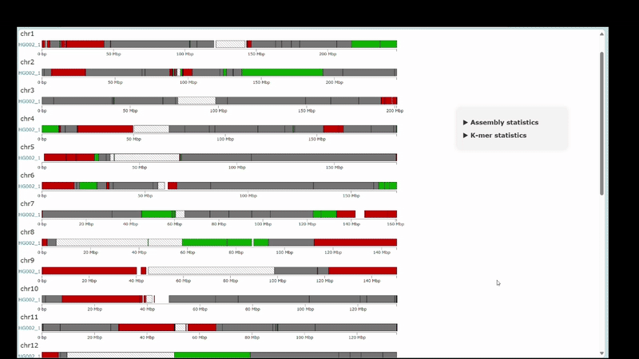

# T2T-Assembly Visualization

This project extends [QUAST](https://github.com/ablab/quast) and its Icarus module to improve visualization of telomere-to-telomere (T2T) genome assemblies, particularly for evaluating haplotype-resolved assemblies against complete reference genomes like T2T-CHM13.

---

## Features

- **Block merging**: Combines nearby alignment blocks
- **Alignment filtering**: Excludes short alignments (< 1,000 bp)
- **Centromere handling**: Aggregates centromeric alignments into unified blocks
- **Interactive ideogram**: Unified HTML visualization of all chromosomes
- **Haplotype comparison**: Supports evaluation of two haplotypes against a reference

---

## Example Visualizations


### Single haploid assembly aligned to T2T reference


### Two haplotypes aligned to T2T reference


---

## Output

After running QUAST with this visualization module, results are saved in the `output/icarus_viewers` directory:

```bash
output/icarus_viewers/
└── all_chromosomes.html
