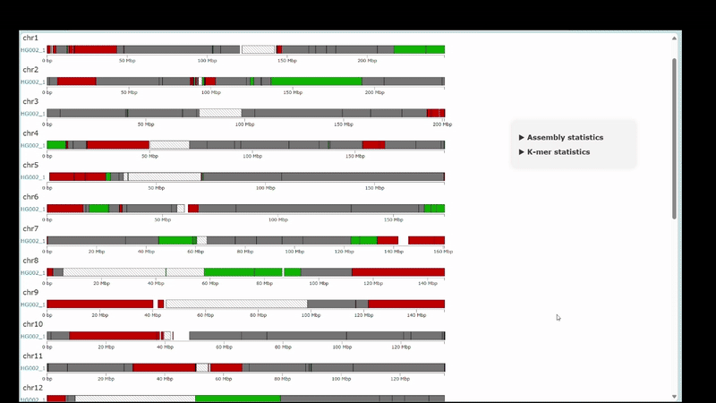

# T2T-Assembly Visualization

This project extends [QUAST](https://github.com/ablab/quast) and its Icarus module to improve visualization of telomere-to-telomere (T2T) genome assemblies. The modified Icarus viewer provides a unified all-chromosomes visualization, improved alignment block handling, centromere-aware visualization, and an additional assembly statistics panel.

The workflow was originally developed for haplotype-resolved human assemblies against the T2T-CHM13 reference and was later extended to support the chicken GGswu reference.

---

## Features

- **Block merging**: combines nearby alignment blocks into larger continuous blocks.
- **Alignment filtering**: excludes short alignment blocks below a configurable threshold.
- **Centromere handling**: aggregates alignments inside centromeric regions into unified centromere blocks.
- **Human and chicken centromere support**:
  - Human CHM13 centromere regions are used by default.
  - Chicken GGswu centromere regions can be enabled with `--chicken`.
- **Custom centromere BED support**: users can provide their own BED file with `--centromeres-bed`.
- **Interactive all-chromosomes ideogram**: displays all reference chromosomes in one HTML page.
- **Assembly statistics panel**: shows key QUAST metrics directly in the Icarus all-chromosomes viewer.

---

## Configurable Options

### `--max-distance`

Default: `50000`

Maximum distance in bp between adjacent alignment blocks to merge.

### `--min-alignment-len`

Default: `1000`

Minimum length in bp of an alignment block to keep.

### `--chicken`

Use the built-in chicken GGswu centromere BED file.

The current chicken BED file contains CENP-A-supported centromere ranges for 33 chromosomes from the chicken-T2T repository.

### `--centromeres-bed`

Path to a custom BED file with centromere coordinates.

This option overrides the default species-specific centromere BED file.

---

## Built-in Centromere BED Files

The built-in centromere files are stored in:

    quast/quast_libs/ca_utils/centromeres/

Current files:

    human_CHM13.bed
    chicken_GGswu.bed

Default behavior:

    without --chicken   -> human_CHM13.bed
    with --chicken      -> chicken_GGswu.bed

---

## Example Usage

### Human CHM13 example

    python quast.py \
      -r path/to/CHM13_reference.fa.gz \
      --large \
      --no-snps \
      path/to/assembly.fasta

### Chicken GGswu example

    python quast.py \
      --chicken \
      -r path/to/GGswu_reference.fa.gz \
      --large \
      --no-snps \
      path/to/assembly.fasta

### Custom centromere BED example

    python quast.py \
      --centromeres-bed path/to/custom_centromeres.bed \
      -r path/to/reference.fa.gz \
      --large \
      --no-snps \
      path/to/assembly.fasta

---

## Icarus Output

After running QUAST, the all-chromosomes viewer is saved in:

    output/icarus_viewers/all_chromosomes.html

The viewer includes:

- all reference chromosomes in one page,
- merged and filtered alignment blocks,
- centromere blocks,
- misassembly indicators,
- legend panel,
- assembly statistics panel.

The assembly statistics panel currently shows:

- Assembly
- Total length
- # contigs
- N50
- L50
- Largest contig
- Genome fraction

---

## Example Visualizations

### Single haploid assembly aligned to T2T reference

### Two haplotypes aligned to T2T reference

---

## Notes

Chicken centromere coordinates in `chicken_GGswu.bed` are based on CENP-A-supported ranges from the chicken-T2T repository and are available for 33 chromosomes.

For chromosomes without CENP-A-supported ranges, no centromere block is shown unless a custom BED file is provided.
